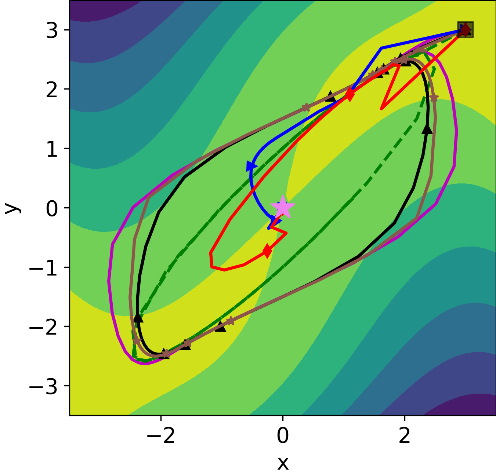

# [GDA-AM: Solve minimax optimization via Anderson Acceleration(Mixing) in ICLR 2022](https://openreview.net/forum?id=3YqeuCVwy1d)

by
Huan He, 
Shifan Zhao,
Joyce Ho,
Yuanzhe Xi,
Yousef Saad

This paper has been accepted in ICLR 2022.
> Implementation of GDA-AM in Python and Matlab. It is a new approach to solve minimax optimization that shows significant improvement over existing methods including Extragradient and Optimistic Gradient Descent. It uses Anderson Acceleration to transform GDA to a convergent mapping. 



*Baseline methods fail to converge, whereas GDA-AM exhibits desirable behaviors.*


## Abstract

> Many modern machine learning algorithms such as generative adversarial networks (GANs) and adversarial training can be formulated as minimax optimization. Gradient descent ascent (GDA) is the most commonly used algorithm due to its simplicity. However, GDA can converge to non-optimal minimax points. We propose a new minimax optimization framework, GDA-AM, that views the GDA dynamics as a fixed-point iteration and solves it using Anderson Mixing to converge to the local minimax. It addresses the diverging issue of simultaneous GDA and accelerates the convergence of alternating GDA. We show theoretically that the algorithm can achieve global convergence for bilinear problems under mild conditions. We also empirically show that GDA-AM solves a variety of minimax problems and improves adversarial training on several datasets. 


## Software implementation

All matlab codes used to generate the results and figures in the paper are in
the `matlab_GDAAM` folder.


## Experiments


## Citations

You can freely use and modify the code, without warranty, so long as you provide attribution
to the authors.
```
@inproceedings{
he2022gdaam,
title={{GDA}-{AM}: {ON} {THE} {EFFECTIVENESS} {OF} {SOLVING} {MIN}-{IMAX} {OPTIMIZATION} {VIA} {ANDERSON} {MIXING}},
author={Huan He and Shifan Zhao and Yuanzhe Xi and Joyce Ho and Yousef Saad},
booktitle={International Conference on Learning Representations},
year={2022},
url={https://openreview.net/forum?id=3YqeuCVwy1d}
```
