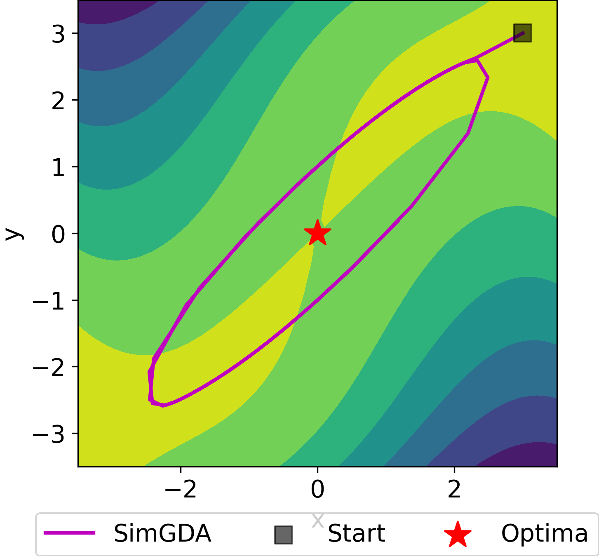

# [GDA-AM: Solve minimax optimization via Anderson Acceleration(Mixing)](https://openreview.net/forum?id=3YqeuCVwy1d)

by
Huan He, 
Shifan Zhao,
Joyce Ho,
Yuanzhe Xi,
Yousef Saad

This paper has been accepted in ICLR 2022.
> Implementation of GDA-AM in Python and Matlab. It is a new approach to solve minimax optimization that shows significant improvement over existing methods including Extragradient and Optimistic Gradient Descent. It uses Anderson Acceleration to transform GDA to a convergent mapping. 



*Baseline methods fail to converge, whereas GDA-AM exhibits desirable behaviors.*


## Abstract

> Many modern machine learning algorithms such as generative adversarial networks (GANs) and adversarial training can be formulated as minimax optimization. Gradient descent ascent (GDA) is the most commonly used algorithm due to its simplicity. However, GDA can converge to non-optimal minimax points. We propose a new minimax optimization framework, GDA-AM, that views the GDA dynamics as a fixed-point iteration and solves it using Anderson Mixing to converge to the local minimax. It addresses the diverging issue of simultaneous GDA and accelerates the convergence of alternating GDA. We show theoretically that the algorithm can achieve global convergence for bilinear problems under mild conditions. We also empirically show that GDA-AM solves a variety of minimax problems and improves adversarial training on several datasets. 


## Software implementation

> Briefly describe the software that was written to produce the results of this
> paper.

All source code used to generate the results and figures in the paper are in
the `code` folder.
The calculations and figure generation are all run inside
[Jupyter notebooks](http://jupyter.org/).
The data used in this study is provided in `data` and the sources for the
manuscript text and figures are in `manuscript`.
Results generated by the code are saved in `results`.
See the `README.md` files in each directory for a full description.


## Dependencies

You'll need a working Python environment to run the code.
The recommended way to set up your environment is through the
[Anaconda Python distribution](https://www.anaconda.com/download/) which
provides the `conda` package manager.
Anaconda can be installed in your user directory and does not interfere with
the system Python installation.
The required dependencies are specified in the file `environment.yml`.

We use `conda` virtual environments to manage the project dependencies in
isolation.
Thus, you can install our dependencies without causing conflicts with your
setup (even with different Python versions).

Run the following command in the repository folder (where `environment.yml`
is located) to create a separate environment and install all required
dependencies in it:

    conda env create


## Reproducing the results

Before running any code you must activate the conda environment:

    source activate ENVIRONMENT_NAME

or, if you're on Windows:

    activate ENVIRONMENT_NAME

This will enable the environment for your current terminal session.
Any subsequent commands will use software that is installed in the environment.

To build and test the software, produce all results and figures, and compile
the manuscript PDF, run this in the top level of the repository:

    make all

If all goes well, the manuscript PDF will be placed in `manuscript/output`.

You can also run individual steps in the process using the `Makefile`s from the
`code` and `manuscript` folders. See the respective `README.md` files for
instructions.

Another way of exploring the code results is to execute the Jupyter notebooks
individually.
To do this, you must first start the notebook server by going into the
repository top level and running:

    jupyter notebook

This will start the server and open your default web browser to the Jupyter
interface. In the page, go into the `code/notebooks` folder and select the
notebook that you wish to view/run.

The notebook is divided into cells (some have text while other have code).
Each cell can be executed using `Shift + Enter`.
Executing text cells does nothing and executing code cells runs the code
and produces it's output.
To execute the whole notebook, run all cells in order.


## Citations

You can freely use and modify the code, without warranty, so long as you provide attribution
to the authors.
```
@inproceedings{
he2022gdaam,
title={{GDA}-{AM}: {ON} {THE} {EFFECTIVENESS} {OF} {SOLVING} {MIN}-{IMAX} {OPTIMIZATION} {VIA} {ANDERSON} {MIXING}},
author={Huan He and Shifan Zhao and Yuanzhe Xi and Joyce Ho and Yousef Saad},
booktitle={International Conference on Learning Representations},
year={2022},
url={https://openreview.net/forum?id=3YqeuCVwy1d}
```
